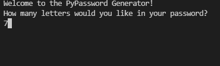
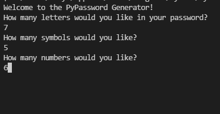
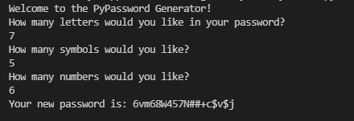

# Python-Password-Generator

## Run main.py in the command line interface

### You will be asked to indicate the number of letters desired for your new password.

### Answer the subsequent questions for symbols and numbers.

### A new password will be generated with completely random letters, symbols and numbers ordered in a completely random sequence.
